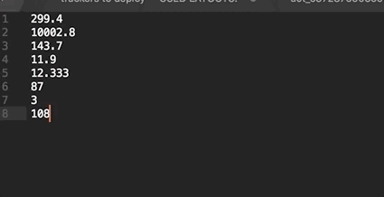

# sublime-sum-numbers
Sublime plugin for summing numbers

### Instructions
**macOS** - save sum.py in folder:
> /Users/*{user_name}*/Library/Application Support/Sublime Text 3/Packages/User

**Windows**
> %APPDATA%\Sublime Text 3\Packages

keybindings for example:
> { "keys": ["command+shift+o"], "command": "sum"}

#### How it works:  

